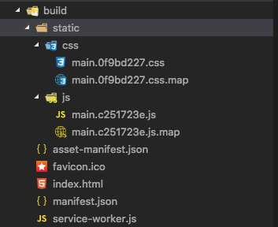

## 添加 ant-design，修改配置文件

我们需要自定义 webpack 的配置，[react-app-rewire](https://github.com/timarney/react-app-rewired) 提供了修改配置的功能。

这里为了演示功能，使用 eject 的方式来获取 webpack 配置文件，之后再根据实际情况去自定义相应的配置。 

#### 获取 webpack 的各项配置

```bash
npm run eject
```
在 config 文件夹下就出现了类似 `webpack.config.*.js` 的文件。

#### 添加 babel-plugin-import

[babel-plugin-import](https://github.com/ant-design/babel-plugin-import) 是一个用于按需加载组件代码和样式的 babel 插件。安装该插件后，来修改 babel 配置。

先安装插件:
```bash
npm install babel-plugin-import --save-dev # 或者 yarn babel-plugin-import --dev
```
现在要使用该插件，需要配置 babel。打开 package.json 文件，找到 "babel" 对应的字段。修改为以下内容。
```json
{
  "babel": {
    "presets": [
      "react-app"
    ],
    "plugins": [
      "import",
      { "libraryName": "antd", "libraryDirectory": "es", "style": "css" }
    ]
  }
}
```
#### 添加 less-loader

如果你已经项目添加了 react-app-rewire，使用 less 是非常容易的，调用 rewireLess 函数就完成各项配置。但是现在的话，要我们自己手动添加配置了。😞 好在 [react-app-rewire-less](https://github.com/timarney/react-app-rewired/blob/master/packages/react-app-rewire-less/index.js) 的源码清晰易读，我们可以参考它的思路来配置。

首先安装依赖包：
```bash
npm install less less-loader --save-dev # yarn add less less-loader --dev
```
less 必须安装，不然就会出现 **Module build failed: Error: Cannot find module 'less'** 的错误信息。

接下来修改 `webpack.config.dev.js`：
```js
// 先把处理 css 文件的 loader 配置提取出来
const cssUseLoaders = [
  require.resolve('style-loader'),
  // ... 省略了一些
]
module.exports = {
  // ...
  module: {
    rules: [
      // ...
      {
        oneOf: [
          // 把处理 less 文件配置放在 oneOf 数组的最前面
          {
            test: /\.less$/,
            use: [
              ...cssUseLoaders,
              { loader: 'less-loader', options: {} }
            ]
          },
          // ...
          {
            test: /\.css$/,
            use: cssUseLoaders
          },
          // 避免 file-loader 处理 less 文件
          {
            exclude: [/\.(js|jsx|mjs)$/, /\.html$/, /\.json$/, /\.less$/],
            loader: require.resolve('file-loader'),
          }
        ]
      }
    ]
  }
}
```
按照同样的思路修改 `webpack.config.prod.js`：
```js
// 把处理 css 文件的 loader 配置提取出来
const cssUseLoaders = ExtractTextPlugin.extract({
  Object.assign({
    //...
  })
})
module.exports = {
  // ...
  module: {
    rules: [
      // ...
      {
        oneOf: [
          // 把处理 less 文件配置放在 oneOf 数组的最前面
          {
            test: /\.less$/,
            use: [
              ...cssUseLoaders,
              { loader: 'less-loader', options: {} }
            ]
          },
          // ...
          {
            test: /\.css$/,
            use: cssUseLoaders
          },
          // 避免 file-loader 处理 less 文件
          {
            exclude: [/\.(js|jsx|mjs)$/, /\.html$/, /\.json$/, /\.less$/],
            loader: require.resolve('file-loader'),
          }
        ]
      }
    ]
  }
}
```
#### 开始动手开发项目

webpack 终于配置好了 😂 ！开始正式进入开发流程。修改 `App.js`，添加 ant-design 的组件以及样式代码，看看效果如何。
```js
import React from 'react'
import { Layout } from 'antd'
import './App.less'

const { Header, Content, Footer } = Layout
class App extends React.Component {
  render() {
    return (
      <Layout className="app">
        <Header>ant design snippets</Header>
        <Content className="main-content">
          Content
        </Content>
        <Footer>Copyright © 2018</Footer>
      </Layout>
    )
  }
}
```
#### 项目打包构建

在命令行中输入 npm run build，看看打包后的代码是否符合我们的预期。


#### 编写一个简单的文件服务器

如果我们现在要预览打包后生成的项目话，需要编写一个简单的文件服务器。我们可以使用 [golang](https://golang.org/pkg/net/http/#FileServer) 编写一个静态文件服务器。
```go
package main

import (
	"log"
	"net/http"
)

func main() {
	fs := http.FileServer(http.Dir("build"))
	http.Handle("/", fs)
	log.Println("Listening...")
	http.ListenAndServe(":5001", nil)
}
```
在命令行执行 `go run server.go`，打开浏览器就可以看到运行效果了。🙃

#### 下一步

在很多的 react 项目中，redux 是必不可少的。所以下一步，我们将以一个小例子来说明 redux 的用法。
